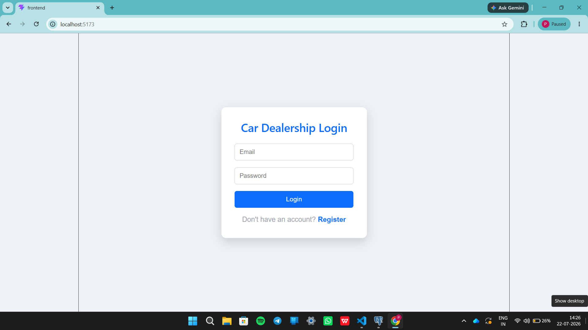
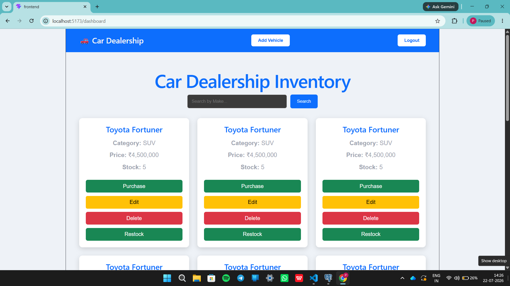
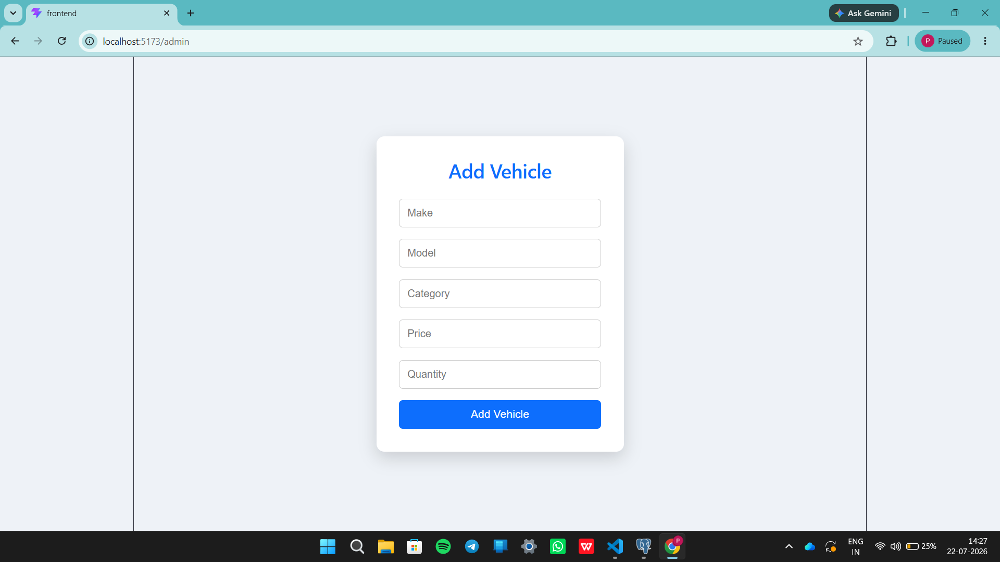
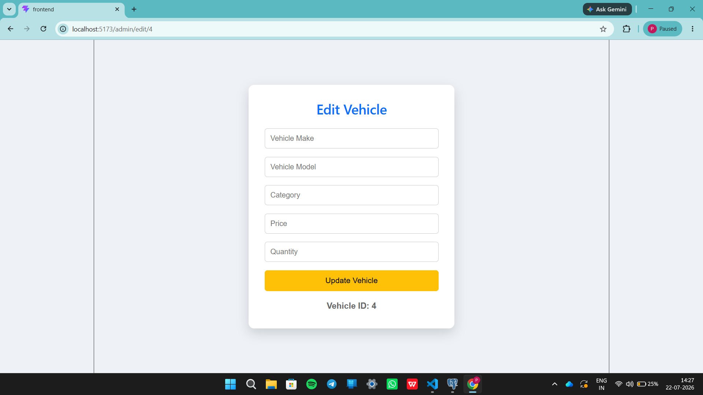
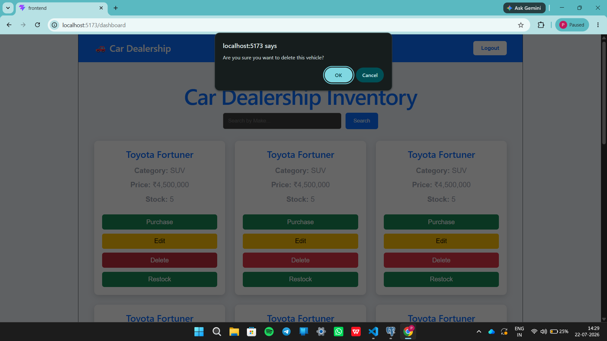
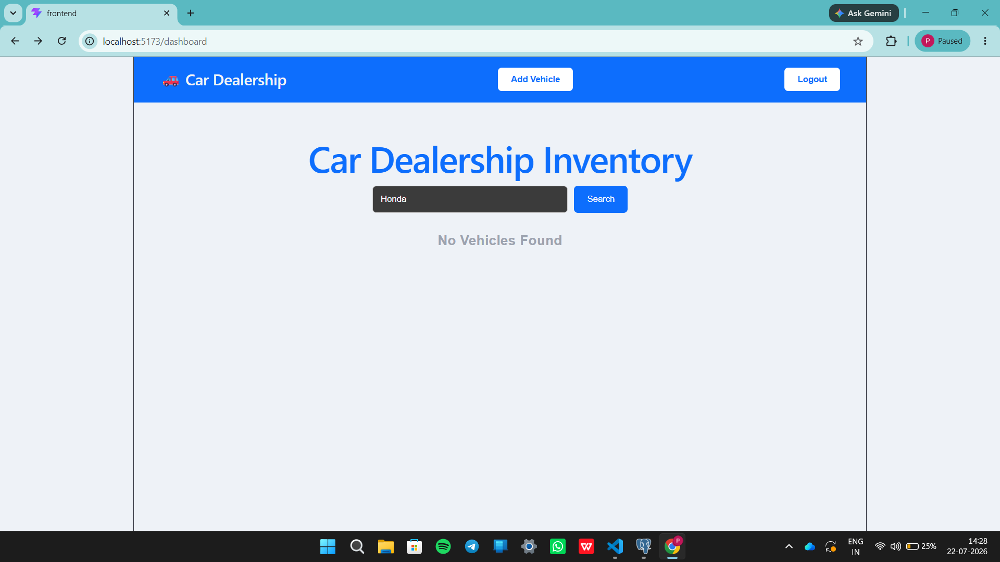
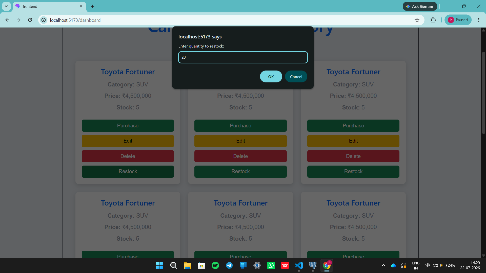
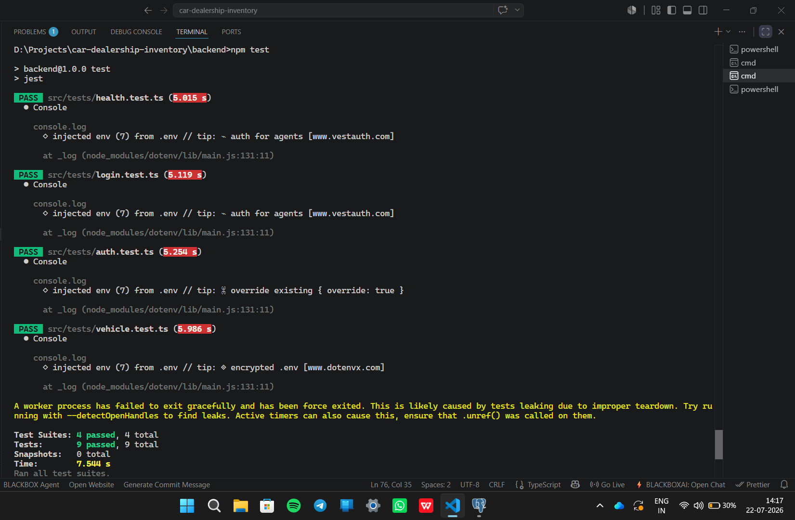

# 🚗 Car Dealership Inventory System

This project was developed as part of the TDD Kata using React.js, Node.js, Express.js, PostgreSQL, and Test-Driven Development (TDD). AI assistance (ChatGPT) was used during development and is documented in the **My AI Usage** section.

## Project Overview 

The **Car Dealership Inventory System** is a full-stack web application developed to simplify the management of vehicle inventory for a car dealership. It provides a secure and user-friendly platform where customers can browse available vehicles, search by different criteria, and purchase vehicles, while administrators can efficiently manage the inventory.

The application follows a client-server architecture with a **React.js** frontend, a **Node.js and Express.js** backend, and a **PostgreSQL** database. It also implements **JWT (JSON Web Token) authentication** to provide secure user login and **role-based access control** to restrict administrative operations to authorized users only.

The project was developed using **Test-Driven Development (TDD)** principles, with backend APIs tested using **Jest** and **Supertest** to ensure reliability and correctness. 

## Project Objectives

- Build a secure full-stack web application using modern web technologies.
- Implement user authentication and role-based authorization.
- Allow users to browse, search, and purchase vehicles.
- Enable administrators to add, update, delete, and restock vehicle inventory.
- Apply RESTful API design for communication between the frontend and backend.
- Practice Test-Driven Development (TDD) by writing and executing automated tests.
- Gain hands-on experience with React, Express, PostgreSQL, and JWT authentication.

## Key Features

### User Features

- User registration and login
- Secure JWT authentication
- View all available vehicles
- Search vehicles by make
- Purchase vehicles
- Logout functionality

### Admin Features

- Secure administrator access
- Add new vehicles
- Edit existing vehicle details
- Delete vehicles
- Restock vehicle inventory
- Manage dealership inventory

## Technology Stack

### Frontend
- React.js
- React Router DOM
- Axios
- CSS

### Backend
- Node.js
- Express.js
- TypeScript

### Database
- PostgreSQL

### Authentication
- JWT (JSON Web Token)
- bcrypt

### Testing
- Jest
- Supertest

  =====================================================================================================================================================

  # 🚀 Local Setup and Running the Project

Follow the steps below to set up and run the Car Dealership Inventory System on your local machine.

## Prerequisites

Make sure the following software is installed:

- Node.js (v18 or later)
- npm (comes with Node.js)
- PostgreSQL
- Git
- Visual Studio Code (recommended)

---

## 1. Clone the Repository

```bash
git clone https://github.com/viradiad1-ai/car-dealership-inventory.git
cd car-dealership-inventory
```

---

## 2. Backend Setup

Navigate to the backend folder:

```bash
cd backend
```

Install the required dependencies:

```bash
npm install
```

---

## 3. Configure Environment Variables

Create a `.env` file inside the `backend` directory and add the following:

```env
DATABASE_URL=your_postgresql_connection_string
JWT_SECRET=your_secret_key
PORT=5000
```

Replace the values with your own PostgreSQL connection string and JWT secret.

---

## 4. Configure the Database

- Start the PostgreSQL server.
- Create a database for the project.
- Create the required tables (`users` and `vehicles`) using the provided SQL scripts or migrations.

---

## 5. Start the Backend Server

Run the following command:

```bash
npm run dev
```

The backend server will start at:

```
http://localhost:5000
```

---

## 6. Frontend Setup

Open a new terminal and navigate to the frontend folder:

```bash
cd frontend
```

Install the required dependencies:

```bash
npm install
```

---

## 7. Configure the API URL

Open `frontend/src/services/api.js` and ensure the API base URL is:

```javascript
baseURL: "http://localhost:5000/api"
```

---

## 8. Start the Frontend

Run:

```bash
npm run dev
```

The frontend application will start at:

```
http://localhost:5173
```

---

## 9. Run the Application

Open your browser and visit:

```
http://localhost:5173
```

You can now:

- Register a new account
- Log in to the system
- Browse available vehicles
- Search vehicles
- Purchase vehicles

If logged in as an administrator, you can also:

- Add new vehicles
- Edit vehicle details
- Delete vehicles
- Restock vehicle inventory

---

## 10. Running Tests

Navigate to the backend directory:

```bash
cd backend
```

Run the test suite:

```bash
npm test
```

The project uses **Jest** and **Supertest** for backend testing.

---

## Project URLs

| Service | URL |
|---------|-----|
| Frontend | http://localhost:5173 |
| Backend API | http://localhost:5000/api |

---

## Troubleshooting

- Ensure PostgreSQL is running before starting the backend.
- Verify that the `.env` file contains the correct database connection string and JWT secret.
- Start the backend before launching the frontend.
- If dependencies are missing, run `npm install` in both the `backend` and `frontend` directories.
- If API requests fail, verify that the API base URL in `frontend/src/services/api.js` points to the correct backend address.

======================================================================================================================================
  # 📸 Screenshots of Final Application

## Login Page



---

## Dashboard



---

## Add Vehicle



---

## Edit Vehicle



---

## Delete Vehicle



---

## Search Vehicle



---

## Restock Vehicle



---
======================================================================================================================================

## My AI Usage

### AI Tool Used

- ChatGPT (OpenAI GPT-5.5)

### How I Used AI

- Planned the project architecture
- Designed backend APIs
- Generated boilerplate code
- Implemented JWT authentication
- Built React components
- Debugged backend and frontend issues
- Wrote Jest and Supertest test cases
- Assisted with deployment
- Helped prepare the README documentation

### Reflection

ChatGPT accelerated development by helping me understand concepts, debug issues, and generate starter code. I reviewed, modified, tested, and integrated all AI-generated suggestions before including them in the final project.

=================================================================================================================================================================

# 🧪 Test Report

The backend was tested using **Jest** and **Supertest** to verify the application's core functionalities, including authentication and vehicle management APIs.

## Testing Framework

- Jest
- Supertest

## Running the Tests

```bash
cd backend
npm test
```

## Test Results

| Test Suite | Status |
|------------|--------|
| Health API Tests | ✅ Passed |
| Authentication Tests | ✅ Passed |
| Login Tests | ✅ Passed |
| Vehicle API Tests | ✅ Passed |

### Test Summary

- **Test Suites:** 4 Passed
- **Total Tests:** 9 Passed
- **Failed Tests:** 0
- **Success Rate:** **100%**

### Test Execution Screenshot



## Conclusion

All automated backend tests passed successfully. The application correctly handles authentication, authorization, vehicle CRUD operations, search functionality, purchasing, and inventory management.
